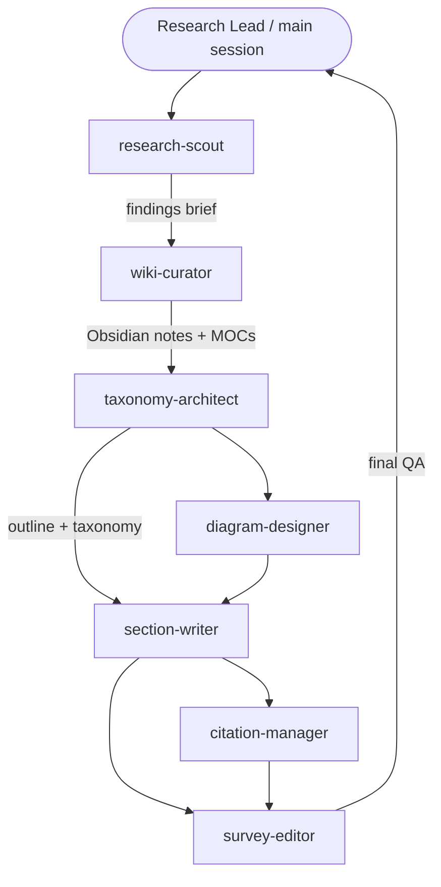

# Agent Team — LLM Memory Survey

A Claude Code subagent team for collaboratively writing an **English academic survey on memory
in Large Language Models**, built on a self-contained **Obsidian** knowledge base and
**Mermaid** diagrams.

The **main Claude session is the Research Lead / Orchestrator** — it owns the master plan and
delegates to the specialists below via the `Agent` tool.

## Team roster

| Agent | Role | Tools |
|-------|------|-------|
| `research-scout` | Investigates one LLM-memory subtopic → structured findings brief | Read, Glob, Grep, WebSearch, WebFetch |
| `wiki-curator` | Turns findings into atomic Obsidian notes + MOCs; owns the vault | Read, Write, Edit, Glob, Grep |
| `taxonomy-architect` | Designs the memory taxonomy + survey outline | Read, Write, Edit, Glob, Grep |
| `section-writer` | Drafts academic prose per section with `[@cite]` keys | Read, Write, Edit, Glob, Grep |
| `diagram-designer` | Creates & validates Mermaid figures | Read, Write, Edit, Glob, Grep |
| `citation-manager` | Owns `references.bib`; audits citation integrity | Read, Write, Edit, Glob, Grep |
| `survey-editor` | QA pass: coherence, tone, fact-check vs wiki (optional) | Read, Glob, Grep, Edit |

## Pipeline



## Shared conventions

**Obsidian notes** — one concept per note; YAML frontmatter (`title`, `aliases`, `tags`,
`status`); link with `[[Wikilinks]]`; each cluster has a `MOC - <Area>.md`, all under a
top-level `MOC - LLM Memory.md` hub. Tags: `#llm-memory/<subarea>` + a type tag
(`method` / `architecture` / `benchmark` / `concept`).

**Citations** — inline `[@bibkey]`; keys are `<firstauthorlastname><year>`; the
`citation-manager` is the sole owner of `references.bib`. Never fabricate references.

**Mermaid** — fenced ` ```mermaid ` blocks. `mindmap`/`graph TD` for taxonomies,
`flowchart`/`sequenceDiagram` for architectures, `timeline` for history. Short node labels;
validate syntax before handoff.

**Paths** — the Obsidian vault and manuscript locations are passed by the orchestrator (e.g.
`vault/` and `paper/`); they are intentionally not fixed here.

## Scope covered

Context window & long-context · KV-cache · RAG · memory-augmented architectures
(Memory Networks, Transformer-XL, Compressive Transformers, Recurrent Memory Transformer) ·
agent memory (MemGPT, generative agents; episodic/semantic/procedural) · parametric vs
non-parametric memory · knowledge editing (ROME, MEMIT) · vector stores · evaluation benchmarks.

## Usage

From the main session, drive the pipeline, e.g.:

> "Use **research-scout** to survey *KV-cache as memory*, then have **wiki-curator** write the
> atomic notes, and **taxonomy-architect** slot it into the outline."

Each agent keeps its own focused context, so you can fan out subtopics in parallel.
