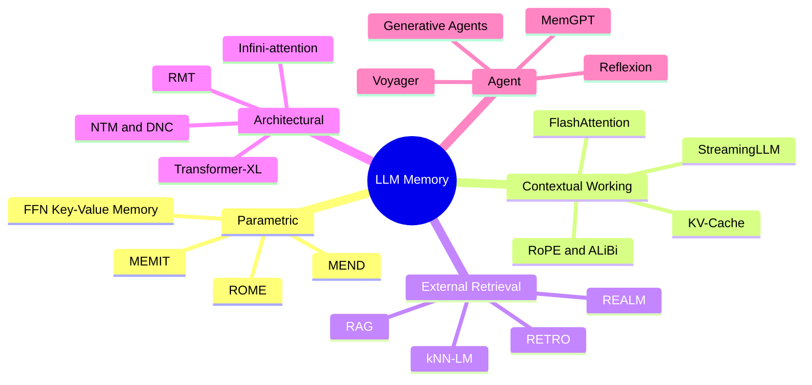
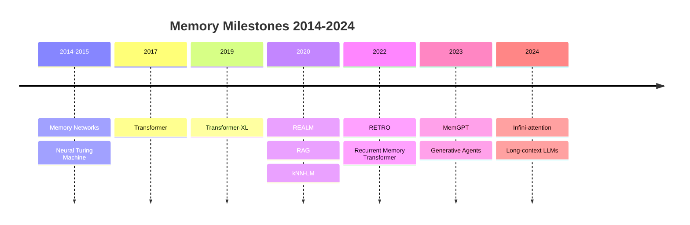
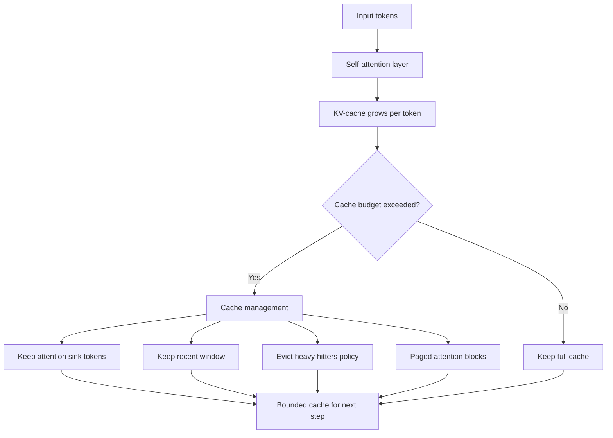
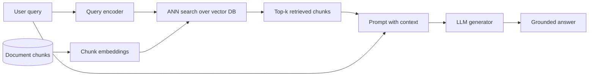
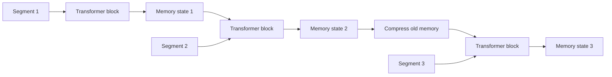
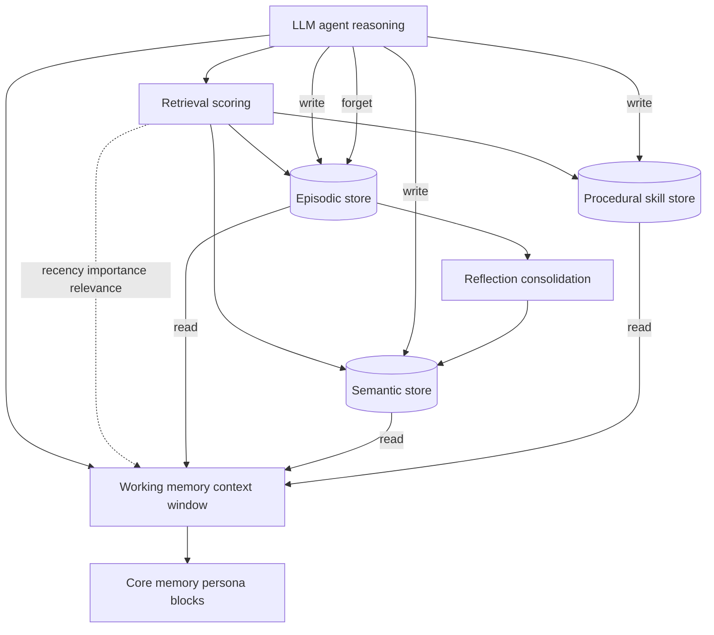

# Figures — A Survey of Memory in Large Language Models

This file holds all Mermaid figures for the survey. Each figure has an exact label heading
(referenced by section writers), a one-sentence caption, and a fenced `mermaid` block.

### Figure: LLM Memory Taxonomy

The five top-level categories of LLM memory with representative methods in each.

### Figure: Memory Timeline

A decade of memory milestones for neural sequence models, from Memory Networks to long-context LLMs.

### Figure: KV-Cache and Attention-Sink Flow

How tokens build the KV-cache and how eviction, attention sinks, and paging bound its growth.

### Figure: RAG Pipeline

The retrieve-then-generate pipeline from query through ANN search to a grounded answer.

### Figure: Segment-Level Recurrence

Carrying or compressing a memory state across fixed-length segments to extend effective context.

### Figure: Agent Memory Architecture

An LLM agent with working and core memory over long-term episodic, semantic, and procedural stores, with retrieval scoring and read/write/forget operations.

