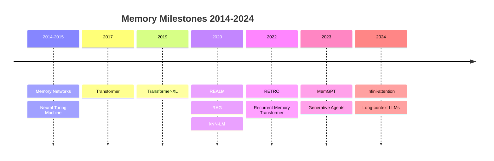
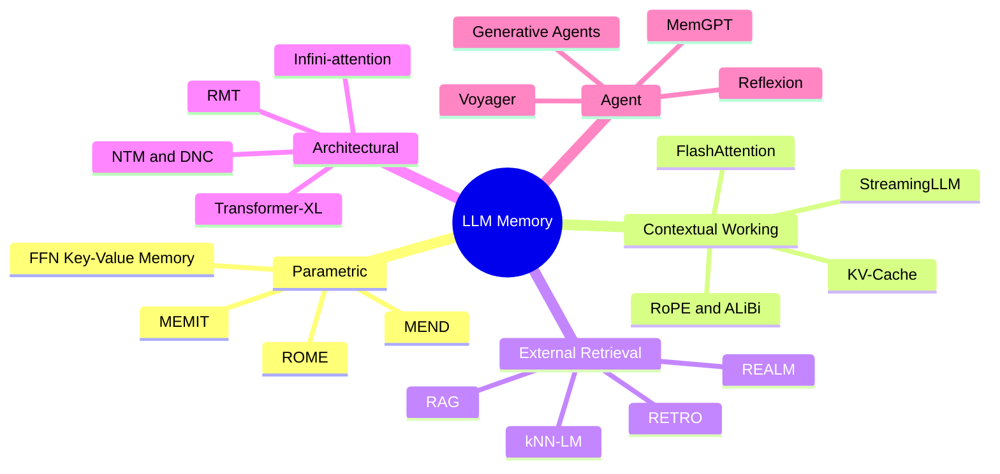
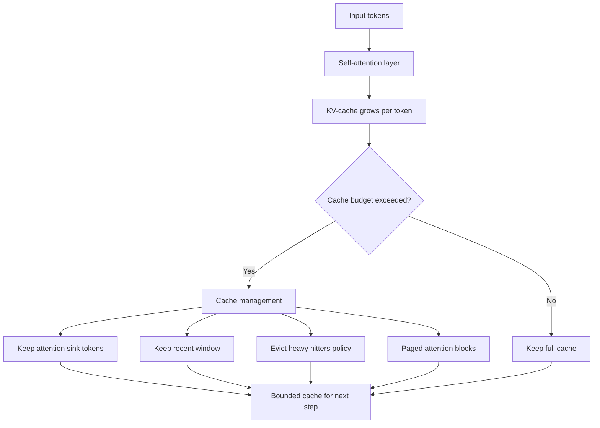
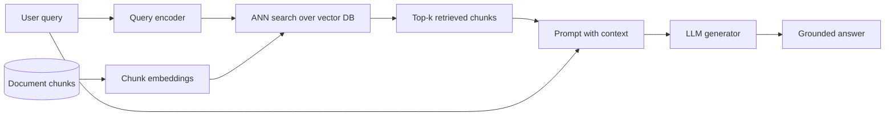
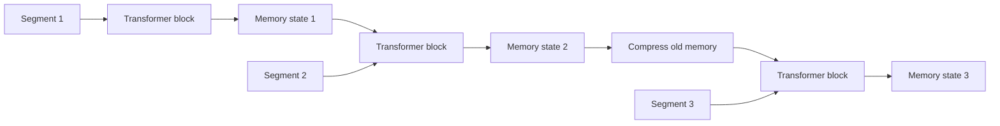
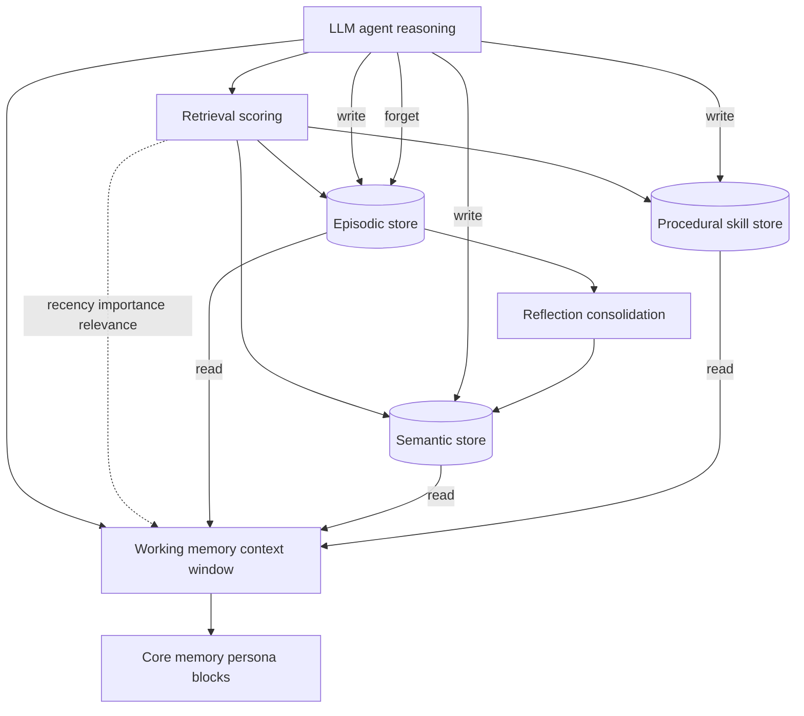

# A Survey of Memory in Large Language Models: Taxonomy, Mechanisms, and Evaluation

## Abstract

Memory — the capacity to store, retain, and recall information — is central to the behavior
and limitations of large language models (LLMs). Yet the term is used for strikingly different
mechanisms: the knowledge compressed into a model's weights, the transient contents of its
context window, the external corpora it retrieves from, the architectural slots that carry
state across time, and the orchestrated stores that let LLM-based agents persist across
sessions. This survey organizes that landscape. We propose a taxonomy of LLM memory along two
axes — *where* information resides and *how long* it persists — yielding five categories:
**parametric**, **contextual/working**, **non-parametric/external**, **architectural**, and
**agent** memory. For each, we describe the underlying mechanisms, representative systems,
and limitations, tracing a line from early memory-augmented neural networks to retrieval
augmentation, long-context Transformers, knowledge editing, and operating-system-style agent
memory. We then survey how memory is evaluated, from efficiency benchmarks to long-context
stress tests and knowledge-editing suites, and highlight the recurring gap between *nominal*
and *effective* memory capacity. We close with open challenges: lifelong and consolidating
memory, principled forgetting, faithful attribution, and evaluation that measures use rather
than mere capacity.

**Keywords:** large language models, memory, retrieval-augmented generation, long context,
knowledge editing, LLM agents, survey.

## 1. Introduction

Large language models (LLMs) built on the Transformer architecture [@vaswani2017] have become
general-purpose engines for language understanding and generation. As they are deployed in
longer conversations, document-scale reasoning, and multi-step autonomous tasks, a single
faculty increasingly governs what they can and cannot do: **memory**. Whether a model can
recall a fact stated thousands of tokens ago, incorporate knowledge that postdates its
training, maintain a consistent persona across a week-long interaction, or accumulate skills
over a long-horizon task are all, at root, questions about how information is stored, retained,
and retrieved.

The difficulty is that "memory" in LLMs is not one mechanism but several, operating at
different locations and timescales. Knowledge acquired during pretraining is compressed into
the model's weights and is, by default, fixed and opaque [@geva2021]. The context window holds
the immediate inputs as a form of volatile working memory, but at a cost that grows
quadratically with length and with no guarantee that distant content is actually used
[@liu2023lost]. External corpora can be consulted at inference time through retrieval, decoupling
knowledge from parameters [@lewis2020]. Specialized architectures add recurrent state or
learnable memory slots that persist across segments [@dai2019]. And LLM-based agents wrap the
model in explicit read/write/forget machinery over episodic, semantic, and procedural stores
[@packer2023; @park2023]. These mechanisms are studied in largely separate literatures, with
different vocabularies and evaluation practices, which makes it hard to see the field as a
whole.

This survey provides that unifying view. We make three contributions:

1. **A taxonomy.** We organize LLM memory by *where* information resides and *how long* it
   persists, yielding five categories — parametric, contextual/working, non-parametric/external,
   architectural, and agent memory (Figure: LLM Memory Taxonomy). The taxonomy situates methods
   that are usually discussed in isolation within a single frame and exposes their trade-offs.
2. **A mechanism-level synthesis.** For each category we explain the core mechanism, survey
   representative systems from foundational work to recent advances, and state the limitations
   that motivate the next category. We connect threads that recur across categories — content-based
   addressing, compression-versus-fidelity, and updatability — rather than treating each system
   as a point solution.
3. **An account of evaluation.** We survey how memory is measured, from efficiency benchmarks
   and long-context stress tests to factual probing and knowledge-editing suites, and we
   emphasize the persistent gap between a model's *nominal* memory capacity (e.g., a context
   window of a given size) and its *effective* capacity (what it can actually use reliably).

**Scope.** We focus on memory in and around Transformer-based LLMs. We include the
memory-augmented neural networks that precede them, because they introduced ideas — external
addressable memory, differentiable read/write — that reappear throughout the modern literature.
We treat efficiency and serving systems (e.g., KV-cache management) where they bear directly on
memory behavior, but we do not attempt a complete survey of efficient inference. We likewise
touch state-space models as an architectural memory alternative without surveying sequence
modeling in full.

**Organization.** Section 2 reviews background on the Transformer, the context window, and our
working definition of memory. Section 3 presents the taxonomy. Sections 4–8 treat the five
categories in turn: parametric memory and knowledge editing (Section 4), contextual and working
memory (Section 5), non-parametric and external memory (Section 6), architectural memory
(Section 7), and agent memory systems (Section 8). Section 9 surveys evaluation and benchmarks.
Section 10 discusses open challenges and future directions, and Section 11 concludes.

## 2. Background

This section establishes the technical and conceptual vocabulary used throughout the survey. It reviews the Transformer and its self-attention mechanism, characterizes the context window as a volatile working memory whose cost scales quadratically with length, identifies the key–value (KV) cache as the operational substrate of that memory, and then clarifies what "memory" denotes in the context of large language models (LLMs), including the human-memory analogies invoked in later sections. It closes by orienting the reader to the five memory categories around which the survey is organized.

### 2.1 The Transformer and Self-Attention

Modern LLMs are built on the Transformer architecture, whose defining component is self-attention [@vaswani2017]. In self-attention, each token is projected into query, key, and value vectors, and every token attends to every other token through a scaled dot-product similarity between queries and keys, producing an output that is a similarity-weighted sum of the value vectors [@vaswani2017]. Because attention is computed over all pairs of tokens, it is content-based and permutation-invariant: the mechanism has no intrinsic notion of order, so positional information must be injected separately through positional encodings [@vaswani2017]. The original Transformer used fixed sinusoidal encodings [@vaswani2017], while later models favor schemes such as rotary embeddings, which rotate queries and keys so that their dot products encode relative position [@su2021roformer], or linear attention biases designed to support extrapolation to longer sequences [@press2021alibi]. Feed-forward sublayers, interleaved with attention, also play a memory role: they have been characterized as key–value memories that store factual associations in their weights [@geva2021], a view that underpins the parametric-memory and knowledge-editing literature discussed later.

### 2.2 The Context Window as Volatile Working Memory

The context window is the finite span of tokens an LLM can attend to at once. It functions as a form of volatile working memory: any information that is not encoded in the model's weights must be present in this window to influence the next prediction. Unlike parametric knowledge stored in the weights, contextual memory is implicit and ephemeral, holding the current prompt, any retrieved documents, and the running generation, and it is discarded once the window scrolls past or the session ends. The capacity of this working memory is bounded by self-attention, whose time and memory cost grow quadratically, as O(n^2), in the sequence length n, because every token attends to every other token [@vaswani2017]. This quadratic cost is the central bottleneck that historically capped context windows at a few thousand tokens and that motivates the efficient-attention and long-context lines of work, including sparse-attention schemes such as Longformer [@beltagy2020longformer] and BigBird [@zaheer2020bigbird], and hardware-aware exact-attention implementations such as FlashAttention [@dao2022flashattention; @dao2023flashattention2]. A larger window, moreover, is not the same as usable memory: models exhibit a positional bias in which they fail to reliably use information placed in the middle of long contexts, a failure mode termed "lost in the middle" [@liu2023lost]. The context window is thus shaped by both a hard limit, set by the trained maximum position and extendable through interpolation methods [@chen2023pi; @peng2023yarn], and a soft limit on which positions the model can actually exploit.

### 2.3 The KV-Cache as the Operational Memory Substrate

During autoregressive generation, a Transformer caches the key and value vectors of all previously processed tokens, so that each new token computes attention against this cache rather than recomputing the entire prefix. This KV-cache is the concrete substrate of the model's short-term contextual memory. Its size grows linearly with sequence length, number of layers, and number of attention heads, so for long contexts and large batches the KV-cache—rather than the model weights—becomes the dominant consumer of memory and the binding constraint on serving throughput [@kwon2023pagedattention]. This pressure has driven a family of cache-management techniques: eviction policies that retain only high-impact entries [@zhang2023h2o], structural patterns that preserve a few initial "sink" tokens to enable unbounded streaming at fixed cache size [@xiao2023streamingllm], and operating-system-style memory allocators that reduce fragmentation and raise throughput [@kwon2023pagedattention]. The recurring tension is between retaining enough cache for accurate long-range recall and shrinking it enough to remain fast and fit in memory. Because the KV-cache is the materialized, manipulable form of the context window, it is the locus at which contextual memory is engineered in practice.

### 2.4 What "Memory" Means in LLMs and Human-Memory Analogies

Throughout this survey, "memory" refers broadly to any mechanism by which an LLM-based system retains and later reuses information—whether that information resides in the model's weights, in the live token context, in an external store, in a recurrent architectural state, or in an agent's persistent records. This usage is deliberately functional rather than biological. Nonetheless, the literature frequently borrows analogies from human cognition to organize the design space, and we adopt them descriptively while remaining agnostic about their psychological validity. The most common analogy contrasts working (short-term) memory—mapped onto the transient context window—with long-term memory, mapped onto weights or external stores that persist across interactions. A second, finer distinction, drawn from cognitive psychology, separates declarative memory into episodic memory (time-stamped experiences and events) and semantic memory (distilled, context-independent facts), and contrasts both with procedural memory (skills and executable routines) [@tulving1985]. These categories recur in Section 8, where agent memory systems explicitly implement episodic, semantic, and procedural stores together with read, write, and forget operations over them [@sumers2023; @zhang2024memorysurvey]. We use the human analogies as an organizing convenience; the mechanisms themselves are engineered substrates whose properties—capacity, persistence, updatability, and cost—differ markedly from their biological namesakes.

### 2.5 The Five Memory Categories Used in This Survey

To structure the landscape, the survey organizes LLM memory along where information resides and how long it persists, yielding five categories. Parametric memory is knowledge baked into the model's weights during pretraining, compact and fluent but opaque and hard to update [@geva2021]. Contextual (working) memory is the volatile context window and its KV-cache, together with the methods that enlarge and manage them [@vaswani2017]. External or retrieval memory is non-parametric knowledge held outside the model and fetched on demand, as in retrieval-augmented generation and nearest-neighbor language models [@lewis2020; @khandelwal2020]. Architectural memory comprises recurrence and learned memory mechanisms built into the model itself, from external-memory neural networks [@graves2014] to segment-recurrent and recurrent-memory Transformers [@dai2019; @bulatov2022]. Finally, agent memory denotes orchestrated, persistent read/write/forget machinery layered atop an LLM to support long-horizon, multi-session behavior [@packer2023; @park2023]. These categories are not mutually exclusive—agent systems, for instance, typically combine contextual, external, and parametric memory—but they provide a tractable axis along which to compare mechanisms, costs, and evaluation methods. The full taxonomy and its organizing axes are previewed in **Figure: LLM Memory Taxonomy** and developed in detail in Section 3.

### Figure: Memory Timeline

A decade of memory milestones for neural sequence models, from Memory Networks to long-context LLMs.

## 3. A Taxonomy of LLM Memory

We organize the field along two questions: **where** does the information physically reside,
and **how long** does it persist relative to a single forward pass? These two axes separate
mechanisms that are otherwise easy to conflate — for instance, a fact baked into the weights
and the same fact pasted into the prompt are both "memory," but they differ in location
(parameters vs. activations), persistence (permanent vs. single inference), and updatability
(requires training vs. trivially editable). Crossing the axes yields five categories, summarized
in Figure: LLM Memory Taxonomy and Table 1.

**(1) Parametric memory.** Knowledge stored implicitly in the model's weights, acquired during
pretraining. It is permanent across inferences, dense and compressed, and accessed without any
explicit lookup — but it is opaque, costly to update, and prone to becoming stale. The
feed-forward layers of the Transformer behave like key–value memories that store such
associations [@geva2021], and a line of work locates and rewrites individual facts in the
weights [@meng2022]. *(Section 4.)*

**(2) Contextual / working memory.** The transient contents of the context window, realized in
the attention activations and the KV-cache. This is the model's working memory: high-fidelity
and immediately usable, but volatile (it vanishes after the sequence), bounded in size, and
quadratically expensive in length [@vaswani2017]. Positional encodings, efficient attention,
KV-cache management, and context-extension methods all push on these limits, yet effective use
still degrades for information far from the prompt's edges [@liu2023lost]. *(Section 5.)*

**(3) Non-parametric / external memory.** Knowledge kept outside the model in a corpus or vector
store and pulled in at inference time via retrieval [@lewis2020]. It is explicit, inspectable,
and easily updated — add or remove a document without retraining — and supports attribution, at
the price of dependence on retrieval quality. *(Section 6.)*

**(4) Architectural memory.** Memory built into the network as recurrent state or learnable
slots that carry information across segments or steps, rather than residing in a flat context
window. This lineage runs from external-memory neural networks with differentiable read/write
[@graves2014] to segment-recurrent and compressive Transformers [@dai2019; @rae2020] and
fixed-size recurrent state in state-space models. It extends the temporal reach of the model but
trades fidelity for a bounded memory footprint. *(Section 7.)*

**(5) Agent memory.** Memory as an orchestrated system around the LLM: explicit stores for
episodic, semantic, and procedural content, with policies for what to write, when to retrieve,
how to score relevance, and when to forget [@packer2023; @park2023]. It targets persistence
across sessions and long-horizon tasks and draws directly on cognitive analogies, but the
read/write/forget policies are largely heuristic. *(Section 8.)*

**Cross-cutting threads.** Three ideas recur across categories and are worth tracking. First,
*content-based addressing* — retrieving by similarity rather than by location — appears in
attention, in differentiable memories, and in vector retrieval alike. Second, the
*compression–fidelity trade-off*: any mechanism that summarizes the past into a bounded state
(compressive Transformers, recurrent state, rolling summaries) buys reach at the cost of detail.
Third, *updatability*: the categories form a spectrum from hardest to update (parametric) to
trivially updatable (external/context), which largely explains why retrieval and editing have
become the dominant routes to keeping LLM knowledge current.

These categories are deliberately not mutually exclusive in practice — a deployed system may
combine a retrieval store, a long context window, and an agent memory manager on top of fixed
parametric knowledge. The taxonomy describes mechanisms, not products; real systems compose
them, and Section 10 returns to how they interact.

*Table 1. The five categories of LLM memory.*

| Category | Where it resides | Persistence | Updatable? | Representative work |
|---|---|---|---|---|
| Parametric | Model weights | Permanent | Hard (training/editing) | FFN-as-memory [@geva2021], ROME [@meng2022] |
| Contextual / working | Activations, KV-cache | Single inference | Trivial (change prompt) | Long-context attention [@beltagy2020longformer], StreamingLLM [@xiao2023streamingllm] |
| Non-parametric / external | Corpus / vector store | Until edited | Easy (edit corpus) | RAG [@lewis2020], RETRO [@borgeaud2022] |
| Architectural | Recurrent state / memory slots | Across segments | Via mechanism | NTM [@graves2014], Transformer-XL [@dai2019] |
| Agent | External orchestrated stores | Across sessions | Explicit read/write | MemGPT [@packer2023], Generative Agents [@park2023] |

### Figure: LLM Memory Taxonomy

The five top-level categories of LLM memory with representative methods in each.

## 4. Parametric Memory and Knowledge Editing

Parametric memory is the knowledge a language model stores implicitly in its weights, acquired during pretraining and retrieved through a forward pass rather than by consulting an external store. In the taxonomy of this survey (see Figure: LLM Memory Taxonomy), it is the form of memory that lives entirely inside the model: compact, fast, and capable of fluent generalization, but also opaque, expensive to update, and prone to staleness and hallucination as the world changes. Probing studies established early that this memory is substantial. The LAMA benchmark showed that pretrained models already encode a surprising amount of relational knowledge accessible through cloze-style queries, suggesting that a language model can act, to a degree, as an unsupervised knowledge base [@petroni2019]. Because such knowledge is distributed across the weights, the central practical question becomes whether a single fact can be updated, inserted, or erased without retraining the model and without disturbing everything else it knows.

### 4.1 Where factual knowledge lives: FFN layers as key-value memories

A mechanistic account of how facts are stored grounds most of the editing literature. Geva et al. showed that the feed-forward (FFN/MLP) sublayers of a Transformer operate as key-value memories: the rows of the first linear layer act as keys that detect input patterns, while the columns of the second layer act as values that induce distributions over the output vocabulary [@geva2021]. Lower layers tend to capture shallow lexical and syntactic patterns, whereas upper layers store more semantic and factual associations, with each layer's output a weighted sum of value vectors gated by key activations. A follow-up analysis refined this picture, framing FFN value vectors as promoting human-interpretable concepts directly in the vocabulary space and progressively refining the model's prediction across depth [@geva2022]. This view is the conceptual basis for locate-and-edit methods: if a fact is stored as a specific key-value association in a particular MLP layer, then changing that fact reduces, in principle, to modifying that layer's weights.

### 4.2 Locating facts

Two complementary localization strategies operationalize this idea at different granularities. Causal tracing, introduced alongside ROME, identifies *where* a factual association is computed by running the model three times: a clean run on a factual prompt, a corrupted run in which the subject tokens' embeddings are noised so the model fails, and a series of restored runs in which individual hidden states from the clean run are patched back into the corrupted run one at a time [@meng2022]. States whose restoration most recovers the correct prediction are deemed causally important, and the procedure revealed a decisive role for mid-layer MLP modules at the last subject token. At a finer grain, the knowledge-neuron method of Dai et al. uses integrated-gradients attribution over FFN intermediate activations to score how much each neuron contributes to predicting a fact's object, isolating a small set of neurons tied to that fact; suppressing or amplifying them predictably weakens or strengthens the corresponding prediction [@dai2022]. Together these results show that parametric factual memory is partly localizable, at both layer and neuron granularity, although the localizations later proved more debatable than first assumed.

### 4.3 Editing methods

The editing literature falls into three broad families. **Locate-then-edit** methods compute closed-form weight updates to MLP layers. ROME (Rank-One Model Editing) edits a single factual association in a GPT-style model by treating one mid-layer MLP's second linear layer as a linear associative memory mapping a subject key to an object value, then applying a rank-one update that inserts a new key-value pair while minimally disturbing existing ones [@meng2022]. Compared with naive fine-tuning, ROME improves generalization to paraphrases while keeping unrelated predictions stable, but it edits only one fact at a time. MEMIT (Mass-Editing Memory In a Transformer) generalizes this to inserting thousands of associations at once by spreading the update across a range of critical mid-layer MLPs and solving a least-squares objective that incorporates many new memories while preserving old ones, scaling far better than applying ROME repeatedly, which tends to accumulate damage [@meng2023].

**Meta-learning / hypernetwork editors** instead learn to predict weight changes. KnowledgeEditor, from De Cao et al., trains a separate network that, conditioned on the fact to be changed, outputs the required parameter shift, framing editing as a constrained optimization that changes the target prediction while keeping behaviour on other inputs as unchanged as possible [@decao2021]. MEND (Model Editor Networks using Gradient Decomposition) exploits the low-rank structure of the fine-tuning gradient for a single example, decomposing it so a small hypernetwork can map it to a targeted, locality-preserving update efficiently even for models with billions of parameters [@mitchell2022mend]. Because the editor is learned, edits are fast at inference and require no gradient steps on the base model.

**Memory-based / semi-parametric** methods avoid weight surgery altogether. SERAC keeps the base model frozen and stores edits in an explicit external memory; at inference a learned scope classifier decides whether an input falls under a stored edit and, if so, routes it to a small counterfactual model, otherwise letting the original model answer [@mitchell2022serac]. This design makes edits easy to add, revise, or roll back and handles long sequences of edits gracefully, blurring the line between knowledge editing and retrieval-based memory.

### 4.4 Evaluation criteria

Across these families, edits are judged on a shared set of axes first crystallized by the early hypernetwork work [@decao2021]. *Reliability* (or efficacy) asks whether the new fact is actually recalled; *generalization* asks whether paraphrases and logically entailed queries also change; and *locality* (or specificity) asks whether unrelated facts and skills are preserved. A portability dimension is sometimes added to capture downstream reasoning over the edited fact. The counterfactual benchmark CounterFact and the QA-style zsRE dataset have become standard testbeds for these metrics, the former emphasizing generalization and locality and the latter providing question-answering style edits.

### 4.5 Updating versus forgetting, and continual learning

Keeping parametric memory current requires both adding or revising facts and removing outdated or unwanted ones, and the difficulty in either direction is doing so surgically. Intentional, targeted forgetting—erasing a specific fact, capability, or memorized private text—is studied as machine unlearning, where the model should behave as if it had never seen the target data while retaining everything else. The unwanted counterpart is catastrophic forgetting, the tendency of a network to lose previously acquired knowledge when gradient updates for new information overwrite the weights that encoded the old [@mccloskey1989]. This is precisely why editing methods optimize explicitly for locality, and it reappears in large models during instruction tuning and domain adaptation, where new training can erode pretrained knowledge. Continual-learning mitigations carry over directly: regularization that protects important weights, such as Elastic Weight Consolidation [@kirkpatrick2017], replay of past examples, and parameter-isolation approaches. The governing tension is the stability-plasticity dilemma—too much plasticity overwrites old knowledge, too much stability blocks new learning—which makes sequential editing a continual-learning problem in disguise: applying many edits in turn tends to accumulate interference and drift, degrading both edited and unrelated facts. This is part of why batched (MEMIT) and external-memory (SERAC) approaches are attractive.

### 4.6 Limitations

Several limitations temper the locate-and-edit program. The localization premise itself has been questioned: later work showed that *where* a fact can be successfully edited does not always coincide with where causal tracing localizes it, weakening the assumption that the causal site is the right edit site. Closed-form editors remain sensitive to sequential application, accumulating damage over many edits, and even when an edit succeeds on a fact and its paraphrases it may fail to propagate to logically entailed consequences, exposing a gap between surface efficacy and genuine knowledge updating. Memory-based methods sidestep weight damage but shift complexity to the scope classifier and the external store, inheriting routing-failure modes closer to retrieval. These open issues motivate the contextual, non-parametric, and agentic forms of memory examined in the sections that follow.

## 5. Contextual and Working Memory

Beyond the knowledge stored in their weights, large language models maintain a second, qualitatively different form of memory: the information held in the live span of tokens they can attend to. This section treats the context window as a model's *working memory* — finite, volatile, and the anchor for the current prompt, retrieved evidence, and ongoing generation. We organize the discussion around how this working memory is bounded, encoded, made efficient, managed at serving time, extended, and — crucially — why a larger window does not translate into uniformly usable recall.

### 5.1 The Context Window as Working Memory

In a Transformer language model, the context window is the finite set of tokens the model can attend to at once, and it functions as a form of volatile working memory: any information not encoded in the weights must be present in this window to influence the next prediction [@vaswani2017]. Unlike parametric (long-term) memory, context memory is implicit and ephemeral, vanishing once tokens scroll out of view. Its effective capacity is bounded directly by the self-attention mechanism. In scaled dot-product attention each token computes query, key, and value projections and attends to every other token, so both time and memory cost scale as O(n^2) in sequence length n [@vaswani2017]. This quadratic cost is the central bottleneck for treating long contexts as working memory: it historically capped windows at a few thousand tokens and motivates nearly every technique discussed below, from sparse and IO-aware attention to cache management. Because attention is content-based and permutation-invariant, position information must be injected separately, which makes positional encoding the first lever for expanding usable context.

### 5.2 Positional Encodings for Length Generalization

How position is encoded largely governs *length generalization* — whether a model trained up to some length behaves correctly on longer inputs, effectively enlarging its working memory without retraining. Rotary Position Embedding (RoPE) rotates the query and key vectors by an angle proportional to their position before computing attention [@su2021roformer]. Because the dot product of two rotated vectors depends only on their relative offset, RoPE injects relative position into an absolute formulation, yields smooth decay of attention with distance, and has become the dominant scheme in modern LLMs. Its limitation is that models trained at one context length degrade well beyond it, since high-frequency rotary components encounter out-of-distribution angles — a shortcoming that motivates the extension methods of Section 5.5. ALiBi (Attention with Linear Biases) takes a different route, removing learned positional embeddings entirely and adding a static negative bias to attention scores that grows linearly with query–key distance, with a fixed per-head slope [@press2021alibi]. This parameter-free penalty biases each head toward a characteristic range and was designed explicitly for extrapolation: a model trained on short sequences can be evaluated on much longer ones with little degradation. The trade-off is a built-in recency bias that can hurt retrieval of information far back in the context.

### 5.3 Efficient and Long-Context Attention

A second family of methods attacks the quadratic cost directly. Longformer replaces full attention with a sparse pattern that scales linearly, combining a sliding local window with a small set of global tokens that attend to and are attended by all positions [@beltagy2020longformer]; dilated windows widen the local receptive field, while global anchors such as a classification token integrate information across the whole sequence. BigBird generalizes this with three components — local window, global tokens, and random connections per token — whose small-world connectivity lets information propagate between any two positions in a few layers; the authors further prove BigBird is a universal approximator and Turing complete, preserving the theoretical power of full attention while handling sequences several times longer than standard BERT [@zaheer2020bigbird]. Both sparsify the attention math. FlashAttention instead keeps attention *exact* but makes it IO-aware: it tiles the query, key, and value matrices, computes attention block by block, and uses online softmax with rescaling so the full attention matrix is never materialized, cutting memory from O(n^2) to O(n) and delivering large wall-clock speedups [@dao2022flashattention]. FlashAttention-2 further improves parallelism and work partitioning [@dao2023flashattention2]. Because it is exact, FlashAttention complements rather than competes with sparse methods, simply making longer working-memory windows practical to train and serve.

### 5.4 KV-Cache Management

At inference time, the working memory takes a concrete form. During autoregressive generation a Transformer caches the key and value vectors of all prior tokens so each new token attends against the cache rather than recomputing the prefix; this KV-cache is the operational substrate of context memory. Its size grows linearly with sequence length, layers, and heads, so for long contexts and large batches the cache — not the weights — becomes the dominant memory consumer and the binding constraint on serving throughput. Three complementary strategies manage this pressure, illustrated in **Figure: KV-Cache and Attention-Sink Flow**. StreamingLLM exploits *attention sinks* — the observation that models dump large attention mass onto the first few tokens regardless of relevance — by always retaining a few initial sink tokens alongside a recent window, enabling stable generation over millions of tokens at fixed cache size [@xiao2023streamingllm]. H2O (Heavy-Hitter Oracle) instead selects content-adaptively: a small set of "heavy hitter" tokens accounts for most attention mass, so H2O keeps these plus recent tokens and greedily evicts the rest as a dynamic submodular problem [@zhang2023h2o]. PagedAttention, introduced in the vLLM serving system, attacks fragmentation rather than logical size, managing the cache like operating-system virtual memory: each sequence's cache is split into fixed-size blocks stored non-contiguously and resolved through a block table, which nearly eliminates fragmentation and enables copy-on-write sharing of common prefixes, raising throughput [@kwon2023pagedattention]. These methods compose: paging the cache is orthogonal to deciding which entries to evict.

### 5.5 Context Extension

A further line extends the trained window of an existing model rather than retraining from scratch. Position Interpolation (PI) linearly down-scales position indices so inputs longer than the training length map back into the original range of rotary angles, keeping attention scores in-distribution; a short fine-tuning stage then adapts the model, expanding context (e.g., LLaMA from 2k to 32k tokens) cheaply [@chen2023pi]. Uniform interpolation, however, compresses high-frequency rotary dimensions that encode fine local order, blurring short-range resolution. YaRN addresses this by scaling RoPE frequencies non-uniformly, interpolating low-frequency dimensions while leaving high-frequency ones near their original values, following NTK-aware reasoning, and adding an attention-temperature adjustment to keep the softmax well-scaled [@peng2023yarn]. YaRN reaches far longer windows (e.g., 64k–128k tokens) with substantially less fine-tuning than plain interpolation.

### 5.6 Larger Windows Are Not Uniform Recall

A recurring caveat unifies these advances: a large nominal context is not the same as usable working memory. The "lost in the middle" finding shows that long-context LLMs use their window unevenly, retrieving information near the beginning or end of the input far more reliably than content buried in the middle, producing a U-shaped accuracy curve over position [@liu2023lost]. The effect persists even in models explicitly extended to long contexts, exposing a gap between advertised and *effective* context length and likely arising from positional-encoding behavior, attention sinks, and recency effects. Practically, enlarging the window via interpolation or YaRN can preserve fluency while leaving mid-context recall weak, so document ordering and retrieval ranking materially affect answer quality. This distinction — between low perplexity and genuine long-range retrieval — frames the evaluation methods discussed later and motivates the external, persistent memory architectures explored in subsequent sections.

### Figure: KV-Cache and Attention-Sink Flow

How tokens build the KV-cache and how eviction, attention sinks, and paging bound its growth.

## 6. Non-Parametric and External Memory

### 6.1 Parametric versus Non-Parametric Memory

A useful organizing distinction for memory in large language models separates knowledge that is stored implicitly in model weights from knowledge that is held explicitly in an external store. Parametric memory is acquired during pretraining and accessed through a forward pass: it is compact, fast, and supports fluent generalization and reasoning, but it is also opaque, difficult to update, prone to staleness as the world changes, and a frequent source of confident factual errors. Non-parametric memory, by contrast, keeps knowledge in an external resource—a text corpus, document index, or vector database—that the model queries at inference time. Because this store is decoupled from the weights, it can be edited, swapped, or grown without retraining, and it can supply provenance for generated claims. The distinction was made central by retrieval-augmented generation [@lewis2020], which paired a parametric sequence-to-sequence generator with a non-parametric Wikipedia index accessed through dense retrieval. In practice, most retrieval-augmented systems are hybrids: a parametric model whose generation is conditioned on non-parametric retrieved evidence, combining the fluency of the former with the updatability and verifiability of the latter.

### 6.2 The Retrieve-then-Generate Paradigm

The dominant framework for external memory is retrieval-augmented generation (RAG), in which a model's input is augmented with passages fetched from an external corpus so that generation is grounded in retrieved evidence rather than parametric memory alone. The original RAG model [@lewis2020] couples a dense passage retriever over a Wikipedia index with a BART generator and proposes two variants: RAG-Sequence, in which a single retrieved document conditions the entire output, and RAG-Token, in which the model can attend to different documents at different decoding steps. Retriever and generator are trained jointly end-to-end, and the approach improves performance on knowledge-intensive tasks such as open-domain question answering while reducing hallucination by anchoring outputs in retrieved text. Since then, the term "RAG" has broadened well beyond this specific architecture to describe almost any retrieve-then-generate pipeline built around an LLM and a vector store. The canonical pipeline—corpus ingestion and chunking, embedding and indexing, query embedding, approximate nearest-neighbor retrieval, and conditioning the generator on the retrieved context—is summarized in Figure: RAG Pipeline.

### 6.3 Foundational Retrieval-Augmented Language Models

Several models established that explicit non-parametric memory can complement or substitute for parametric memory, differing in where retrieval is injected and how tightly it is integrated.

kNN-LM [@khandelwal2020] augments a pretrained autoregressive language model with token-level nearest-neighbor retrieval over a datastore of cached context-representation and next-token pairs. At inference, the current context's hidden representation queries the datastore for its k most similar contexts, and the empirical distribution over their next tokens is interpolated with the base model's softmax distribution. This lets the model recall rare patterns and long-tail facts without updating any parameters, improving perplexity, and the datastore can be expanded or swapped to adapt to new domains. Its costs are the large storage footprint of the datastore and the latency of per-token similarity search.

REALM [@guu2020] was among the first methods to integrate a learned retriever into pretraining itself. During masked language modeling, REALM retrieves documents using a neural knowledge retriever and conditions masked-token predictions on the retrieved text, so the retriever is trained by backpropagating the language modeling signal. To keep retrieval over a large corpus tractable, it uses Maximum Inner Product Search over a document-embedding index that is asynchronously refreshed as the encoder updates. Its key contribution is showing that retrieval can be learned end-to-end as part of pretraining rather than bolted on afterward, at the cost of the engineering complexity of keeping the index synchronized.

RETRO [@borgeaud2022] retrieves from a database of trillions of tokens and fuses retrieved neighbors into generation through a dedicated chunked cross-attention mechanism. Input sequences are split into chunks; for each chunk, the model retrieves nearest-neighbor chunks and their continuations using a frozen embedding and approximate nearest-neighbor search, then attends to them. RETRO demonstrated that a relatively small model with retrieval can match the performance of models an order of magnitude larger in parameters, effectively offloading factual memorization to the non-parametric database, whose contents can be updated without retraining the weights.

Atlas [@izacard2022] is a retrieval-augmented encoder-decoder built for strong few-shot learning on knowledge-intensive tasks. It pairs a dense retriever with a Fusion-in-Decoder reader and shows that careful joint training lets a comparatively small (e.g., 11B-parameter) model match or exceed far larger parametric models on open-domain QA and fact checking with very few training examples. Atlas studies retriever objectives, such as attention distillation and perplexity-based losses, that let the language modeling signal supervise retrieval without explicit relevance labels, underscoring the sample efficiency of retrieval augmentation.

### 6.4 Retrieval Machinery: Dense Retrieval, Vector Databases, and ANN Search

The effectiveness of these systems rests on the retrieval component. Dense Passage Retrieval (DPR) [@karpukhin2020] learns to embed questions and passages into a shared vector space so that relevant pairs have high inner-product similarity. It uses a dual-encoder—separate BERT encoders for queries and passages—trained with a contrastive objective using in-batch and hard negatives, reducing retrieval to nearest-neighbor search over precomputed passage embeddings. DPR substantially outperformed sparse lexical retrieval such as BM25 by capturing semantic rather than purely lexical matches, and it became the standard retriever component plugged into downstream readers and generators, including RAG [@lewis2020]. Its limitations include sensitivity to the choice of training negatives, weaker handling of rare entities and exact-match terms where lexical methods still help, and the cost of re-encoding the corpus when the encoder changes.

At scale, exact nearest-neighbor search is too slow, so retrieval relies on Approximate Nearest Neighbor (ANN) search, trading a small amount of recall for large speed gains. FAISS is a widely used library for similarity search and clustering of dense vectors, with GPU acceleration and many index types such as flat, inverted-file, and product-quantization indexes [@johnson2019]. HNSW (Hierarchical Navigable Small World) is a graph-based ANN index that builds a multi-layer proximity graph supporting fast greedy search with high recall [@malkov2018]. Inner-product-based retrieval is often termed Maximum Inner Product Search, as used by REALM. These indexes make retrieval over millions to billions of passages feasible at inference time, while introducing trade-offs between recall, latency, memory footprint, and index build and update cost.

### 6.5 Chunking and Embeddings

Before a corpus can serve as non-parametric memory, documents are split into chunks and each chunk is embedded for indexing. Chunking strategy—fixed token windows, sentence or paragraph boundaries, semantic splitting, and overlap between chunks—controls retrieval granularity: chunks that are too large dilute relevance and waste context window, while chunks that are too small fragment meaning and discard the context needed to answer. Embeddings are produced by a text encoder, such as a dual-encoder like DPR [@karpukhin2020], Contriever, or a general text-embedding model, so that semantically similar text lands nearby in vector space, and a query embedding is compared against chunk embeddings via approximate nearest-neighbor search. Practical pipelines also attach metadata to chunks for filtering and attribution. Because retrieval quality is bounded by both embedding quality and chunking choices, poor chunking is a common and often-overlooked source of failure.

### 6.6 Advantages and Failure Modes

External memory offers two central advantages over purely parametric memory: updatability and attribution. Because knowledge lives in an external index, it can be added, removed, or corrected by editing the corpus without retraining, addressing staleness and the high cost of re-pretraining—a hot-swappable knowledge property highlighted by RAG [@lewis2020]. Attribution lets the model cite the specific passages that grounded an answer, improving transparency, verifiability, and the ability to check factuality against sources. These properties make retrieval-augmented systems attractive for fast-moving or proprietary domains.

These guarantees, however, are only as strong as the retrieval. Retrieval errors arise when the index lacks the needed information, when embedding similarity surfaces irrelevant or distracting passages, or when relevant evidence is ranked below the cutoff. Even with correct evidence retrieved, the generator may ignore the context and fall back on parametric memory, or misread and over-generalize the passages, producing claims unsupported by or contradicting the retrieved text. Surveys of hallucination distinguish such faithfulness and grounding failures from factuality failures and note that retrieval can introduce conflicts between parametric and retrieved knowledge [@ji2023]. Long or noisy retrieved contexts can further degrade output through distraction and position effects. Common mitigations include stronger retrievers and rerankers, careful chunking, context filtering, citation and grounding checks, and training the model to abstain when evidence is insufficient. These failure modes constitute the principal limitations balancing the updatability and attribution benefits of non-parametric memory.

### Figure: RAG Pipeline

The retrieve-then-generate pipeline from query through ANN search to a grounded answer.

## 7. Architectural Memory

Architectural memory comprises mechanisms that build the capacity to retain and reuse information directly into the model, rather than relying on the volatile context window, an external retrieval store, or knowledge baked into static weights. The organizing question is where long-range information lives during computation, and how it is written, read, and bounded. This section traces three lines of work: early external-memory neural networks that pair a controller with an explicit addressable memory; recurrence and learned memory grafted onto the Transformer to carry state across segments; and state-space and linear-attention models that fold the entire history into a fixed-size recurrent state. A trade-off recurs across all three: because any architectural memory is finite, capacity is bought at the price of fidelity, and exact recall of arbitrary distant content remains the persistent weakness. The canonical mechanism underlying the recurrent-Transformer line is previewed in **Figure: Segment-Level Recurrence**.

### 7.1 Early External-Memory Neural Networks

The first wave of architectural memory augmented a neural controller with an explicit, addressable memory array accessed by differentiable read and write operations. Memory Networks introduced the influential template of separating a controller from a content-addressable memory, with four learned components: an input map, a generalization module that updates memory slots, an output module that scores slots against a query to select supporting facts, and a response module that converts retrieved memories into an answer [@weston2015]. Demonstrated on question answering that requires chaining several stored facts, the original formulation required strong supervision—the correct supporting memories at each reasoning step had to be labeled during training, because its hard, argmax memory selection was not differentiable end to end [@weston2015]. End-to-End Memory Networks removed this constraint by replacing hard selection with a soft attention read over all slots [@sukhbaatar2015]. Each fact is embedded into both a key memory and a value memory; a query is matched against the keys through a softmax, and the weighted sum of values is returned and added back to the query, with stacked read "hops" enabling multi-step reasoning under weak supervision from the final answer alone [@sukhbaatar2015]. This soft key–value read is a direct conceptual ancestor of the attention used throughout modern Transformers, though attending over every slot makes read cost linear in memory size [@sukhbaatar2015].

In parallel, the Neural Turing Machine (NTM) coupled an LSTM controller to an external memory matrix through fully differentiable read and write heads, giving the network an analogue of an addressable tape [@graves2014]. Its heads combine content-based addressing—matching a key against stored vectors by cosine similarity, with a softmax over the scores giving a soft read weighting—with location-based addressing that shifts along memory rows, supporting both associative recall and iterative, position-relative access [@graves2014]. Writes use erase-and-add vectors in the style of an LSTM gate, and NTMs learned simple algorithms such as copying, sorting, and associative recall that generalize to longer sequences than seen in training [@graves2014]. Their limitations were practical: training was unstable, and the dense addressing could neither allocate nor free memory cleanly and scaled poorly. The Differentiable Neural Computer (DNC) addressed these shortcomings with richer memory management: a dynamic allocation scheme using a usage vector and free list so unused slots can be reused without interference, a temporal link matrix recording the order in which slots were written, and multiple read heads combining content- and allocation-based addressing [@graves2016]. The DNC solved tasks requiring structured memory, such as bAbI question answering and graph traversal, and represents the high-water mark of explicit, von-Neumann-style differentiable memory [@graves2016]. Yet its complexity, brittle training, and poorly scaling dense addressing meant it was never adopted for large-scale language modeling, and the field shifted toward attention- and retrieval-based memory. Content-based addressing is the read primitive these systems share, and it is the same operation that underlies Transformer attention; its principal limitation—scoring against every slot is linear in memory size, and soft attention blurs across many similar slots as memory grows—motivated the approximate retrieval used in later models [@graves2014; @sukhbaatar2015].

### 7.2 Segment-Level Recurrence and Learned Memory in Transformers

Transformer-XL adapted the external-memory idea to the Transformer through segment-level recurrence: a long sequence is split into fixed-length segments, and the hidden states of the previous segment are cached (with gradients stopped) and reused as extended context for the current one, so dependencies span segment boundaries [@dai2019]. Because reused states would otherwise carry inconsistent absolute positions, the scheme is paired with relative positional encoding [@dai2019]. Its limitation is that the cache is a fixed-size sliding window of raw activations that are eventually discarded rather than compressed or retrieved, so context remains bounded by cache size [@dai2019]. This pattern—carrying state across whole blocks rather than single tokens—is the backbone of the recurrent-memory family, and later models differ chiefly in what crosses the boundary. Compressive Transformers add a longer-term memory beneath the short-term cache: when activations age out, a learned compression function (pooling or convolution) maps several old states into fewer compressed vectors, the model attends over both memories, and an attention-reconstruction loss trains the compression to preserve what attention actually uses [@rae2020]. The Recurrent Memory Transformer (RMT) instead passes a small set of learnable memory tokens: special tokens are prepended and appended to each segment, and the output states of the write-memory tokens become the read-memory tokens for the next segment, squeezing cross-segment context into a compact learned state without changing the base attention mechanism [@bulatov2022]; follow-up work recurrently chained many segments to scale to inputs exceeding a million tokens [@bulatov2023]. Both designs trade fidelity for reach: whatever crosses the boundary is finite, so detail is lost over long horizons, and training across many recurrent steps can be unstable [@rae2020; @bulatov2022].

Two further models stretch this line toward retrieval and toward unbounded streaming. Memorizing Transformers give one attention layer access to a large, non-differentiable bank of past key–value pairs, queried with approximate k-nearest-neighbor lookup: each query attends to both local context and the top-k most similar stored keys, blended by a learned gate, allowing recall of facts seen far earlier without retraining and even memory extension at inference time [@wu2022]. This is effectively retrieval over the model's own activations, bridging recurrent and retrieval-augmented memory, at the cost of maintaining a large index and tolerating staleness as representations drift [@wu2022]. Infini-attention instead keeps memory bounded: within each attention layer it maintains a fixed-size associative memory matrix into which the segment's keys and values are written via a linear-attention update and from which current queries read, blending local attention and memory retrieval through a learned gate [@munkhdalai2024]. Because the long-term memory has constant size regardless of sequence length, compute and memory stay fixed per segment, enabling streaming over very long inputs—but the memory is a lossy, fixed-capacity compression that must overwrite or blur older content, degrading recall of distant details [@munkhdalai2024].

### 7.3 State-Space and Linear-Attention Alternatives

A complementary line abandons explicit memory modules and makes a fixed-size recurrent state the memory. Linear attention reframes attention itself as recurrence: replacing the softmax with a kernel feature map lets the computation be rewritten so the model maintains a fixed-size matrix-valued state, updated additively as each token arrives rather than re-attending over all past keys and values [@katharopoulos2020]. This state is an outer-product associative memory into which key–value pairs are written and from which queries read, making inference linear in length with constant memory—precisely the mechanism Infini-attention exploits for its compressive store [@katharopoulos2020; @munkhdalai2024]. The structured state-space model S4 builds each layer on a linear state-space recurrence whose hidden state summarizes all past inputs; its structured, HiPPO-initialized parameterization lets the state optimally compress history while the layer runs as a global convolution at training time and a recurrence at inference, excelling on very long-range dependencies where attention struggles [@gu2022]. Because its state is time-invariant, however, S4 cannot perform exact content-based recall of arbitrary earlier tokens, a weakness on selective-copying and in-context recall tasks [@gu2022]. Mamba addresses this by making the recurrence input-dependent: its selection mechanism makes the state-space parameters functions of the current token, so the model can selectively propagate or forget information and perform content-aware compression, computed with a hardware-aware parallel scan that keeps inference linear with constant-size state [@gu2023]. Mamba matches or beats comparable Transformers across modalities while handling long sequences cheaply, yet its fixed-size state still bounds how much can be remembered, and pure SSMs can trail attention on tasks needing precise long-range copying, motivating hybrid SSM–attention designs [@gu2023].

### 7.4 The Compression–Fidelity Trade-off and Limitations

A single tension threads through every architecture in this section. Architectural memory is, by construction, finite: whether it is the bounded cache of Transformer-XL [@dai2019], the compressed store of Compressive Transformers [@rae2020], the memory tokens of RMT [@bulatov2022], the fixed associative matrix of Infini-attention [@munkhdalai2024], or the recurrent hidden state of S4 and Mamba [@gu2022; @gu2023], the model must reduce an unboundedly growing history into a fixed budget. Compression is the central lever distinguishing these recurrent-memory architectures from exact retrieval methods, and it is lossy: older or fine-grained details blur or are overwritten, distinct memories interfere in a fixed-size state, and the model must learn what to keep [@rae2020; @katharopoulos2020]. Consequently, compressing architectures excel at maintaining a coherent gist of very long context at sub-quadratic cost but remain unreliable for the exact recall of arbitrary distant tokens that attention over a full cache or a non-parametric kNN store can provide [@wu2022]. This residual weakness explains both the persistence of explicit retrieval and the recent interest in hybrid designs that pair a compressed recurrent state with a sparse exact-recall path.

### Figure: Segment-Level Recurrence

Carrying or compressing a memory state across fixed-length segments to extend effective context.

## 8. Agent Memory Systems

Large language models are increasingly deployed as the reasoning core of autonomous agents that pursue goals over long horizons, across many turns, sessions, and tasks. Such agents reason inside a bounded context window that behaves as volatile working memory and is discarded once the session ends. To act coherently over time, an agent must therefore acquire *persistent* memory: a store it can read from, write to, and curate across episodes. The recurring design pattern is to treat the context window as short-term working memory and to build long-term memory as an external store, frequently structured along a cognitive taxonomy and operated through read, write, and forget primitives. The overall organization is previewed in **Figure: Agent Memory Architecture**.

### 8.1 Cognitive-Inspired Memory Types and the CoALA Framing

Agent-memory designs frequently borrow the cognitive-science distinction between short-term (working) memory and long-term memory, mapping each onto a concrete substrate. Working memory is the capacity-bounded buffer the agent reasons over now—almost always the model's context window plus a scratchpad of recent observations and intermediate thoughts—while long-term memory is an external, persistent store realized as a vector database, key–value store, or text log. Following Tulving's psychology, long-term memory is further subdivided into *episodic* memory (specific time-stamped experiences and events), *semantic* memory (distilled, context-independent facts about the world or the user), and *procedural* memory (skills, action policies, and reusable code) [@tulving1985]. The taxonomy is a useful scaffold rather than a strict ontology: real systems blur its boundaries, but it clarifies why a verified skill library reads as procedural memory while an append-only log of experiences is largely episodic.

This vocabulary is consolidated by Cognitive Architectures for Language Agents (CoALA), a conceptual framework that organizes language-agent designs by drawing on classic cognitive architectures such as Soar and ACT-R [@sumers2023]. CoALA analyzes an agent along three axes: its memory components, its action space, and its decision-making procedure. For memory it distinguishes working memory from the three long-term stores—episodic, semantic, and procedural, where the latter includes the LLM weights and the agent's code. It also splits the action space into *internal* actions (reasoning, retrieval, and learning that read and write memory) and *external* actions (grounding in an environment), which situates memory access as a first-class agent action. As a position framework rather than a system, its value is taxonomic: it retrospectively organizes prior work and sets a forward agenda. Its limitation is that the mapping from cognitive constructs to LLM substrates is prescriptive rather than empirically validated. Dedicated agent-memory surveys adopt the same scaffolding to compare disparate systems and to expose missing capabilities such as forgetting and consolidation [@zhang2024memorysurvey].

### 8.2 OS-Style Virtual Context: MemGPT

A prominent way to give an agent the appearance of unbounded memory is to manage the context window like the physical RAM of an operating system, as MemGPT does [@packer2023]. The fixed context (its *main context*) is analogous to RAM, while an external store—archival vector memory plus a recall and message store—plays the role of disk. The LLM itself acts as the processor: through function calls it *pages* information between tiers, deciding when to evict older messages to external storage and when to fetch relevant entries back into context. A self-directed control loop, driven by interrupts and memory-pressure warnings, lets the model issue read and write operations against its own memory, search archival storage, and edit a small, always-resident *core memory* of editable blocks (for example, via append and replace operations) that hold the persona and key user facts. Because these blocks are pinned in context, they are read every turn for free, implementing a form of self-edited semantic memory with guaranteed, low-latency availability. The result is effectively unbounded conversational and document memory without retraining. Its limitations are that the agent must reliably emit correct memory-management calls, that extra LLM turns add latency and cost, and that the controller can page out information it later needs.

### 8.3 The Memory Stream: Retrieval Scoring and Reflection

The canonical design for episodic agent memory is the architecture of Generative Agents, which populates an interactive sandbox with believable simulacra of human behavior [@park2023]. Its central contribution comprises a memory stream, reflection, and planning. The *memory stream* is a comprehensive, append-only record of the agent's experiences in natural language, each entry stamped with creation and last-access times. To act, the agent retrieves a relevant subset using a scoring function that linearly combines three normalized signals: *recency*, an exponential decay since last access that models forgetting curves; *importance*, an absolute salience score the LLM assigns when a memory is created (for example, rating poignancy on a 1–10 scale); and *relevance*, the embedding similarity between the query and the candidate memory. The top-scoring memories are surfaced into context. This scheme is widely reused because it cheaply approximates human-like recall and is tunable, but its weights are hand-set and brittle, importance scoring adds cost and noise, and pure top-*k* retrieval can miss memories that matter only in combination.

The third mechanism, *reflection*, turns raw episodes into reusable abstractions. When the summed importance of recent observations crosses a threshold, the agent poses salient questions over those memories, synthesizes higher-level inferences (for example, a relationship or preference), and writes each insight back into the stream as a new, retrievable node linked to its evidence. This is functionally analogous to human memory consolidation: it compresses many episodic traces into fewer, more general statements, letting later reasoning build on abstractions rather than scanning raw events. Reflection thus produces semantic memory out of episodic memory, improving coherence and reducing retrieval load, but it adds cost and can compound errors when a faulty inference is stored as fact.

### 8.4 Verbal Self-Improvement: Reflexion

Whereas Generative Agents reflect to consolidate social and episodic insight, Reflexion uses a closely related mechanism for task-level self-improvement [@shinn2023]. After an episode, the agent receives a reward signal—often sparse, such as success or failure, a test result, or an LLM-evaluated critique—and a self-reflection module verbalizes *why* it failed and what to do differently. This natural-language reflection is appended to an episodic buffer and placed in context on the next attempt, so the agent conditions on its own past lessons, a procedure termed "verbal reinforcement learning." Notably, improvement requires no gradient updates, yet yields substantial gains on decision-making, multi-hop reasoning, and code generation. Reflexion's memory is therefore a store of distilled lessons rather than raw events. Its quality depends on the reflection model's diagnostic accuracy, the buffer is bounded and must be summarized as it grows, and a misleading reflection can degrade later attempts.

### 8.5 Procedural and Skill Memory: Voyager

Procedural memory stores *how to act*—reusable skills the agent invokes rather than re-derives. Its cleanest LLM realization is Voyager, an embodied agent that plays Minecraft through lifelong learning [@wang2023voyager]. Voyager couples an automatic curriculum that proposes progressively harder goals, an iterative prompting loop that writes control code refined by environment feedback and self-verification, and a growing *skill library*. When a program completes a task and passes verification, it is stored as a reusable skill indexed by an embedding of an LLM-generated description; for new tasks, relevant skills are retrieved and composed, so capabilities compound over time without forgetting. Because skills are executable code, retrieval returns directly runnable behavior, and verification supplies a hard correctness signal that gates what enters memory—a validation criterion absent from episodic and semantic stores, which are judged only by recall accuracy. Voyager substantially outperforms prior agents on exploration breadth and transfers to new worlds, though skills are brittle under environment shifts and the library grows unbounded without abstraction.

### 8.6 Summarization and Compression as Long-Term Memory

A simpler and widely deployed form of long-term memory is summarization: when a dialogue or task history exceeds the context window, the agent compresses older content into a shorter natural-language summary that stays resident while the verbatim text is dropped. *Recursive (rolling) summarization* maintains a running summary that is repeatedly updated as new turns arrive; MemGPT, for instance, flushes evicted messages into a compact recursive summary before paging them to external storage [@packer2023]. The technique was demonstrated at scale by recursively summarizing entire books for long-document abstraction [@wu2021recursively]. As a memory mechanism, summarization trades fidelity for capacity, preserving the gist of a long history at constant context cost, and doubles as a consolidation step that abstracts episodic detail into semantic content. Its limitations are intrinsic: compression is lossy and irreversible, errors compound across recursive passes, and the model may distort facts while summarizing. It is therefore usually paired with a retrievable archival store so that specifics can still be recovered when the summary is insufficient.

Indeed, most agent long-term memory is implemented as retrieval augmentation over the agent's own history: experiences, facts, and skills are embedded and written to a vector store, then retrieved by similarity at decision time and injected into context. This reuses retrieval-augmented generation machinery, but the corpus is self-authored and dynamic rather than a fixed knowledge base, so the system must manage writing, scoring, and forgetting—not merely reading [@park2023; @packer2023; @wang2023voyager]. It thus inherits retrieval failure modes, including embedding mismatch, top-*k* truncation, retrieval of stale or contradictory entries, and the lost-in-the-middle problem once many memories are stuffed into context.

### 8.7 Read, Write, and Forget Operations

Across these systems, agent memory can be decomposed into a small set of primitive operations over an external store, most usefully framed as *read*, *write*, and *forget* (with *update* treated as forget-then-write) [@zhang2024memorysurvey]. Reading is the retrieval step—cueing the store with the current situation and surfacing relevant entries via embedding similarity plus recency and importance scoring. Writing is the encoding step—deciding *what* to store and in what form (raw episode, distilled fact, or executable skill), and *when* to write: on every observation, only on salient events, or after reflection. Forgetting is the deletion or decay step that keeps the store bounded and relevant, through explicit eviction, time-based decay, importance thresholds, or consolidation that replaces many episodes with a summary. Framing memory as these operations exposes precisely which capabilities a given system supports.

Viewed this way, a consistent gap emerges: most current systems implement read and write well but treat forgetting weakly [@sumers2023; @zhang2024memorysurvey]. Stores grow unbounded, stale facts persist, and there is rarely a principled mechanism for selective deletion or conflict resolution. Recency decay in the memory stream, summarization in MemGPT, and verification-gated writes in Voyager are partial answers, but none constitutes managed forgetting in the full sense of deleting safely without losing what later matters. The under-support is partly conceptual—a deletion is correct only relative to future queries the agent has not yet seen—and partly practical, since append-only storage is cheap and removal risks irreversibility. The two hardest open problems are therefore *write selectivity* (avoiding clutter at encoding time) and *managed forgetting* (curating the store without erasing what remains useful), and they remain the principal frontier of agent-memory research.

### Figure: Agent Memory Architecture

An LLM agent with working and core memory over long-term episodic, semantic, and procedural stores, with retrieval scoring and read/write/forget operations.

## 9. Evaluation and Benchmarks

This section surveys the benchmarks and metrics used to measure memory in LLMs. Two broad families are distinguished. The first targets *contextual* or *working* memory: the ability of a model to hold information in its context window and to retrieve, aggregate, and reason over it. The second targets *parametric* memory: the factual knowledge stored in a model's weights, together with the ability to edit that knowledge. Throughout, a recurring theme is the gap between what a benchmark nominally claims to measure and what models can actually do, most visibly in the recurring observation that a model's *effective* context length falls well short of its advertised one.

### 9.1 Efficient and Long-Range Modeling

The earliest standardized benchmark in this space is Long Range Arena (LRA), which evaluates how well architectures, especially efficient-Transformer variants, capture long-range dependencies [@tay2021]. LRA bundles six tasks with sequence lengths ranging from roughly 1K to 16K tokens, including ListOps (hierarchical reasoning), byte-level text classification and document matching, pixel-level image classification, and the Pathfinder/Path-X tasks that test whether two points in an image are connected. The tasks are deliberately diverse in modality and structure so that no single inductive bias dominates, and the suite reports both task accuracy and computational efficiency (speed and memory), enabling an accuracy-versus-cost comparison across architectures. LRA was influential in standardizing claims about "efficient attention" and in exposing that many such methods were not clearly superior to vanilla attention on long-range reasoning. Importantly, LRA probes architectural long-range modeling rather than the retrieval-style behavior of the in-context benchmarks discussed next.

### 9.2 Long-Context Retrieval and Understanding

A second cluster evaluates whether a model can use information held in its context window. These benchmarks split into synthetic stress tests, which isolate retrieval capacity under controlled difficulty, and naturalistic task suites, which test downstream competence over real documents.

The most widely used synthetic probe is the needle-in-a-haystack (NIAH) test, which inserts a single piece of information (the "needle") at a controlled depth inside a long distractor document (the "haystack") and then asks the model to retrieve it [@kamradt2023]. By sweeping the needle's position across many depths and the total length across many sizes, NIAH produces a depth-by-length heatmap of retrieval accuracy that visually exposes where a model's effective context degrades. The format was popularized as an informal evaluation, and a closely related synthetic precursor is the passkey-retrieval task used to probe context extension [@mohtashami2023]. NIAH measures verbatim recall of an isolated fact rather than reasoning or aggregation, so strong NIAH scores do not guarantee broader long-context competence. This limitation motivated RULER, a synthetic benchmark designed to measure the *real* effective context length of long-context models with adjustable lengths and task complexity [@hsieh2024]. RULER generalizes single-needle retrieval into four task categories: multi-needle and multi-key/value retrieval, multi-hop variable tracing, aggregation (e.g., frequent-word extraction), and long-context question answering. Because its data is generated programmatically, RULER can scale to arbitrary lengths while controlling difficulty and avoiding contamination from pretraining data. Its key finding is that many models claiming very large windows maintain accuracy only up to a fraction of their advertised length, so RULER reports an effective context length at which performance stays above a threshold.

Naturalistic suites complement these synthetic probes. LongBench is a bilingual (English and Chinese), multi-task benchmark for long-context understanding on realistic tasks [@bai2024]. It spans six task categories — single-document QA, multi-document QA, summarization, few-shot learning, synthetic tasks, and code completion — across 21 datasets, with standardized output formats and automatic metrics (F1, ROUGE, accuracy, edit similarity) and a balanced "LongBench-E" subset for studying performance versus input length. A later LongBench v2 raises difficulty toward deep reasoning over very long, realistic contexts [@bai2025]. ZeroSCROLLS evaluates natural-language understanding over long texts in a zero-shot setting, without task-specific fine-tuning [@shaham2023]; it builds on the earlier supervised SCROLLS suite [@shaham2022] and adds tasks such as query-based summarization and aggregation (sentiment aggregation, sorting) that require reasoning over the whole input rather than a single span. Pushing the length frontier further, InfiniteBench evaluates models on contexts beyond 100K tokens across twelve English and Chinese tasks spanning retrieval, long-book and long-dialogue QA, summarization, character tracking, mathematical reasoning, and code debugging [@zhang2024]; results showed that even leading long-context models degrade substantially in the 100K+ regime.

A cross-cutting finding sharpens the interpretation of all these benchmarks: a large nominal context window does not imply uniform access to its contents. The "lost in the middle" phenomenon shows that models retrieve information near the beginning or end of an input far more reliably than information buried in the middle, producing a U-shaped accuracy curve over position [@liu2023lost]. This effect holds even for models explicitly trained or extended to long contexts, and it is precisely the gap between advertised length and effective working memory that motivates position-sweeping probes such as NIAH and the effective-length reporting of RULER.

### 9.3 Probing Parametric Knowledge

Turning to weight-resident memory, the canonical probe is LAMA (LAnguage Model Analysis), which measures how much factual and commonsense knowledge a pretrained model stores in its parameters, without fine-tuning [@petroni2019]. LAMA converts relational facts (subject–relation–object triples) from sources such as Wikidata/T-REx, ConceptNet, and SQuAD into cloze statements (e.g., "Dante was born in [MASK]") and checks whether the model ranks the correct object highest, reporting parametric recall accuracy (typically precision-at-1). Its headline finding — that models such as BERT already recall substantial relational knowledge, rivaling some supervised systems — reframed language models as soft knowledge bases. LAMA is also sensitive to prompt phrasing, which motivated later work on prompt robustness.

### 9.4 Knowledge Editing

Knowledge editing is evaluated by two standard benchmarks. CounterFact, introduced alongside locating-and-editing work, is built specifically to distinguish genuine knowledge change from superficial parroting [@meng2022]. Each record pairs a true fact with a counterfactual target and supplies paraphrase prompts (testing generalization), neighborhood prompts about related but distinct subjects (testing locality/specificity), and generation prompts (testing that edits propagate into free-form text). Its metrics include efficacy, paraphrase/generalization score, specificity/neighborhood score, and fluency/consistency measures. Because counterfactual targets are usually false in the world, an edit's success cannot be explained by the fact already being known, making CounterFact a stringent test. The second benchmark, zsRE, originated as a zero-shot relation-extraction dataset that reframes relations as question templates [@levy2017] and was later repurposed for editing: each fact is a question–answer pair, an edit changes the answer, and human-written paraphrases test generalization. Editing evaluations on zsRE report reliability, generalization, and locality. The two complement each other — zsRE emphasizes question-answering-style, plausible facts (insertion/replacement), while CounterFact emphasizes counterfactual robustness.

### 9.5 Summary of Benchmarks

| Benchmark | What it measures | Scale | Citation |
| --- | --- | --- | --- |
| Long Range Arena | Architectural long-range modeling and efficiency (accuracy vs. cost) | 6 tasks, ~1K–16K tokens | [@tay2021] |
| Needle-in-a-Haystack | Verbatim retrieval of a planted fact by depth and length | Single needle, sweeps to long contexts | [@kamradt2023] (passkey precursor [@mohtashami2023]) |
| RULER | Effective context length via multi-needle, tracing, aggregation, QA | 4 task categories, scalable lengths | [@hsieh2024] |
| LongBench / v2 | Naturalistic bilingual long-context understanding and reasoning | 21 datasets, 6 categories; thousands–tens of thousands of tokens | [@bai2024; @bai2025] |
| ZeroSCROLLS (built on SCROLLS) | Zero-shot understanding and aggregation over long documents | Multiple tasks; several thousand–tens of thousands of tokens | [@shaham2023; @shaham2022] |
| InfiniteBench | Long-context recall and reasoning beyond 100K tokens | 12 bilingual tasks, 100K+ tokens | [@zhang2024] |
| LAMA | Parametric recall of relational/commonsense knowledge (precision@1) | Cloze probes over multiple knowledge sources | [@petroni2019] |
| CounterFact | Knowledge-edit efficacy, generalization, locality, fluency | Counterfactual facts with paraphrase/neighborhood/generation prompts | [@meng2022] |
| zsRE | Knowledge-edit reliability, generalization, locality | QA-style facts with paraphrase questions | [@levy2017] |

Taken together, these benchmarks reflect a maturing evaluation landscape. Synthetic suites (LRA, NIAH, RULER) isolate architectural and retrieval capacity under controlled difficulty; naturalistic suites (LongBench, ZeroSCROLLS, InfiniteBench) test downstream long-context competence; and probing and editing benchmarks (LAMA, CounterFact, zsRE) assess parametric memory and its modification. A consistent lesson across the contextual benchmarks is that strong needle-retrieval scores do not imply strong reasoning over long contexts, and that effective context length — sharpened by the lost-in-the-middle effect [@liu2023lost] — remains the more honest figure of merit.

## 10. Open Challenges and Future Directions

The mechanisms surveyed above address memory piecemeal; several problems remain open, and most
of them cut across the taxonomy.

**Lifelong and consolidating memory.** No current category provides true lifelong memory.
Contextual memory is wiped after each sequence; external memory grows monotonically and is never
consolidated; parametric memory is updated only through costly training or brittle edits. Human
memory, by contrast, *consolidates* — transferring salient episodic experience into durable
semantic and procedural form. An analogous loop for LLMs, in which an agent's accumulated
external memory is periodically distilled back into the weights or into compact skills, is
largely unrealized. Editing methods [@meng2023] and skill acquisition [@wang2023voyager] each
capture a fragment of this loop, but a principled, stable consolidation procedure is missing.

**Principled forgetting.** Across categories, forgetting is the weakest operation. External
stores rarely evict; agent memory managers delete heuristically; and in the weights, forgetting
appears mostly as *unwanted* catastrophic interference [@mccloskey1989; @kirkpatrick2017] rather
than as a controllable operation. Yet deliberate forgetting matters for correctness (removing
stale facts), privacy (machine unlearning), and efficiency (bounding memory growth). Making
forgetting selective, verifiable, and non-destructive is an open problem that connects knowledge
editing, continual learning, and agent design.

**Faithfulness and attribution.** Decoupling knowledge from parameters via retrieval was
expected to curb hallucination and enable citation [@lewis2020], but models still ignore,
misread, or override retrieved evidence, and retrieval errors propagate into confident
falsehoods [@ji2023]. Guaranteeing that an answer is *grounded* in the memory it claims to use —
and surfacing that provenance to users — remains unsolved across both retrieval and agent
memory.

**The nominal–effective gap.** Reported memory capacity routinely overstates usable capacity. A
large nominal context window does not imply uniform recall across it [@liu2023lost], and
benchmarks increasingly report an *effective* context length well below the advertised one
[@hsieh2024]. The same gap recurs elsewhere: parametric knowledge that a probe can elicit may
not be used in generation, and an item written to agent memory may never be retrieved when
relevant. Future evaluation should measure memory *use under task pressure*, not storage capacity
in isolation, and should stress multi-hop aggregation rather than single-fact lookup.

**Efficiency and serving.** Memory and cost are inseparable. The KV-cache dominates the memory
footprint of long-context inference, motivating eviction, paging, and sparsity
[@zhang2023h2o; @kwon2023pagedattention]; retrieval shifts cost to an index that must scale to
billions of vectors [@johnson2019; @malkov2018]; and architectural memory trades fidelity for a
bounded state. Co-designing memory mechanisms with the systems that serve them — rather than
treating accuracy and efficiency separately — is an increasingly central concern.

**Unification and interaction.** Finally, the categories are studied in isolation but deployed
together, and their interactions are poorly understood. When a system holds the same fact in its
weights, its context, and its retrieval store, which wins, and how should conflicts be resolved?
A long context window and a retrieval store are partly substitutable; when is each preferable,
and how should they be combined? Cognitive-architecture proposals for agents [@sumers2023] and
emerging memory surveys [@zhang2024memorysurvey] begin to frame these questions, but a predictive
account of how composed memory systems behave is still missing.

## 11. Conclusion

Memory is not a single feature of large language models but a family of mechanisms operating at
different locations and timescales. In this survey we organized that family along two axes —
where information resides and how long it persists — into five categories: parametric,
contextual/working, non-parametric/external, architectural, and agent memory. Reading the field
through this lens reveals a coherent story rather than a scatter of techniques. Knowledge begins
compressed and immovable in the weights; the context window offers high-fidelity but volatile
and bounded working memory; retrieval externalizes knowledge so it can be inspected and updated;
architectural mechanisms extend temporal reach by carrying compressed state; and agent systems
wrap the model in explicit, persistent stores with read, write, and forget policies.

Several threads tie the categories together: content-based addressing as a shared retrieval
primitive, the recurring trade-off between compression and fidelity, and a spectrum of
updatability that explains why retrieval and editing have become the dominant means of keeping
models current. The same lens also clarifies where progress is most needed — lifelong
consolidation, principled forgetting, faithful attribution, and evaluation that measures the
*use* of memory rather than its raw capacity, where nominal and effective limits still diverge
sharply.

As LLMs move from single-turn predictors toward persistent, long-horizon agents, memory is
likely to be the axis along which the most consequential advances occur. We hope the taxonomy
and synthesis offered here give researchers a shared map: a way to place a new method among its
neighbors, to see which trade-offs it accepts, and to identify which of memory's open problems
it leaves unsolved.

## References

Citations use `[@key]` and resolve against `references.bib` (render with `pandoc paper.md --citeproc --bibliography=references.bib`). For convenience, the bibliography is listed here:

- **bai2024** — Bai, Yushi and Lv, Xin and Zhang, Jiajie and Lyu, Hongchang and Tang, Jiankai and Huang, Zhidian and Du, Zhengxiao and Liu, Xiao and Zeng, Aohan and Hou, Lei and Dong, Yuxiao and Tang, Jie and Li, Juanzi (2024). *LongBench: A Bilingual, Multitask Benchmark for Long Context Understanding.* Proceedings of the 62nd Annual Meeting of the Association for Computational Linguistics (ACL).
- **bai2025** — Bai, Yushi and Tu, Shangqing and Zhang, Jiajie and Peng, Hao and Wang, Xiaozhi and Lv, Xin and Cao, Shulin and Xu, Jiajie and Hou, Lei and Dong, Yuxiao and Tang, Jie and Li, Juanzi (2025). *LongBench v2: Towards Deeper Understanding and Reasoning on Realistic Long-context Multitasks.* Proceedings of the 63rd Annual Meeting of the Association for Computational Linguistics (ACL).
- **beltagy2020longformer** — Beltagy, Iz and Peters, Matthew E. and Cohan, Arman (2020). *Longformer: The Long-Document Transformer.* arXiv preprint arXiv:2004.05150.
- **borgeaud2022** — Borgeaud, Sebastian and Mensch, Arthur and Hoffmann, Jordan and Cai, Trevor and Rutherford, Eliza and Millican, Katie and van den Driessche, George and Lespiau, Jean-Baptiste and Damoc, Bogdan and Clark, Aidan and de Las Casas, Diego and Guy, Aurelia and Menick, Jacob and Ring, Roman and Hennigan, Tom and Huang, Saffron and Maggiore, Loren and Jones, Chris and Cassirer, Albin and Brock, Andy and Paganini, Michela and Irving, Geoffrey and Vinyals, Oriol and Osindero, Simon and Simonyan, Karen and Rae, Jack W. and Elsen, Erich and Sifre, Laurent (2022). *Improving Language Models by Retrieving from Trillions of Tokens.* Proceedings of the 39th International Conference on Machine Learning (ICML).
- **bulatov2022** — Bulatov, Aydar and Kuratov, Yuri and Burtsev, Mikhail S. (2022). *Recurrent Memory Transformer.* Advances in Neural Information Processing Systems (NeurIPS).
- **bulatov2023** — Bulatov, Aydar and Kuratov, Yuri and Burtsev, Mikhail S. (2023). *Scaling Transformer to 1M Tokens and Beyond with RMT.* arXiv preprint arXiv:2304.11062.
- **chen2023pi** — Chen, Shouyuan and Wong, Sherman and Chen, Liangjian and Tian, Yuandong (2023). *Extending Context Window of Large Language Models via Positional Interpolation.* arXiv preprint arXiv:2306.15595.
- **dai2019** — Dai, Zihang and Yang, Zhilin and Yang, Yiming and Carbonell, Jaime and Le, Quoc V. and Salakhutdinov, Ruslan (2019). *Transformer-XL: Attentive Language Models beyond a Fixed-Length Context.* Proceedings of the 57th Annual Meeting of the Association for Computational Linguistics (ACL).
- **dai2022** — Dai, Damai and Dong, Li and Hao, Yaru and Sui, Zhifang and Chang, Baobao and Wei, Furu (2022). *Knowledge Neurons in Pretrained Transformers.* Proceedings of the 60th Annual Meeting of the Association for Computational Linguistics (ACL).
- **dao2022flashattention** — Dao, Tri and Fu, Daniel Y. and Ermon, Stefano and Rudra, Atri and R\'e, Christopher (2022). *FlashAttention: Fast and Memory-Efficient Exact Attention with IO-Awareness.* Advances in Neural Information Processing Systems (NeurIPS).
- **dao2023flashattention2** — Dao, Tri (2024). *FlashAttention-2: Faster Attention with Better Parallelism and Work Partitioning.* International Conference on Learning Representations (ICLR).
- **decao2021** — De Cao, Nicola and Aziz, Wilker and Titov, Ivan (2021). *Editing Factual Knowledge in Language Models.* Proceedings of the 2021 Conference on Empirical Methods in Natural Language Processing (EMNLP).
- **geva2021** — Geva, Mor and Schuster, Roei and Berant, Jonathan and Levy, Omer (2021). *Transformer Feed-Forward Layers Are Key-Value Memories.* Proceedings of the 2021 Conference on Empirical Methods in Natural Language Processing (EMNLP).
- **geva2022** — Geva, Mor and Caciularu, Avi and Wang, Kevin Ro and Goldberg, Yoav (2022). *Transformer Feed-Forward Layers Build Predictions by Promoting Concepts in the Vocabulary Space.* Proceedings of the 2022 Conference on Empirical Methods in Natural Language Processing (EMNLP).
- **graves2014** — Graves, Alex and Wayne, Greg and Danihelka, Ivo (2014). *Neural Turing Machines.* arXiv preprint arXiv:1410.5401.
- **graves2016** — Graves, Alex and Wayne, Greg and Reynolds, Malcolm and Harley, Tim and Danihelka, Ivo and Grabska-Barwi\'nska, Agnieszka and Colmenarejo, Sergio G\'omez and Grefenstette, Edward and Ramalho, Tiago and Agapiou, John and others (2016). *Hybrid Computing Using a Neural Network with Dynamic External Memory.* Nature.
- **gu2022** — Gu, Albert and Goel, Karan and R\'e, Christopher (2022). *Efficiently Modeling Long Sequences with Structured State Spaces.* International Conference on Learning Representations (ICLR).
- **gu2023** — Gu, Albert and Dao, Tri (2024). *Mamba: Linear-Time Sequence Modeling with Selective State Spaces.* Conference on Language Modeling (COLM).
- **guu2020** — Guu, Kelvin and Lee, Kenton and Tung, Zora and Pasupat, Panupong and Chang, Ming-Wei (2020). *REALM: Retrieval-Augmented Language Model Pre-Training.* Proceedings of the 37th International Conference on Machine Learning (ICML).
- **hsieh2024** — Hsieh, Cheng-Ping and Sun, Simeng and Kriman, Samuel and Acharya, Shantanu and Rekesh, Dima and Jia, Fei and Ginsburg, Boris (2024). *RULER: What's the Real Context Size of Your Long-Context Language Models?.* Conference on Language Modeling (COLM).
- **izacard2022** — Izacard, Gautier and Lewis, Patrick and Lomeli, Maria and Hosseini, Lucas and Petroni, Fabio and Schick, Timo and Dwivedi-Yu, Jane and Joulin, Armand and Riedel, Sebastian and Grave, Edouard (2022). *Atlas: Few-shot Learning with Retrieval Augmented Language Models.* arXiv preprint arXiv:2208.03299.
- **ji2023** — Ji, Ziwei and Lee, Nayeon and Frieske, Rita and Yu, Tiezheng and Su, Dan and Xu, Yan and Ishii, Etsuko and Bang, Yejin and Madotto, Andrea and Fung, Pascale (2023). *Survey of Hallucination in Natural Language Generation.* ACM Computing Surveys.
- **johnson2019** — Johnson, Jeff and Douze, Matthijs and J\'egou, Herv\'e (2019). *Billion-Scale Similarity Search with GPUs.* IEEE Transactions on Big Data.
- **kamradt2023** — Kamradt, Greg (2023). *Needle In A Haystack -- Pressure Testing LLMs.* GitHub repository, \url{https://github.com/gkamradt/LLMTest_NeedleInAHaystack}.
- **karpukhin2020** — Karpukhin, Vladimir and O\uguz, Barlas and Min, Sewon and Lewis, Patrick and Wu, Ledell and Edunov, Sergey and Chen, Danqi and Yih, Wen-tau (2020). *Dense Passage Retrieval for Open-Domain Question Answering.* Proceedings of the 2020 Conference on Empirical Methods in Natural Language Processing (EMNLP).
- **katharopoulos2020** — Katharopoulos, Angelos and Vyas, Apoorv and Pappas, Nikolaos and Fleuret, Fran\ccois (2020). *Transformers are RNNs: Fast Autoregressive Transformers with Linear Attention.* Proceedings of the 37th International Conference on Machine Learning (ICML).
- **khandelwal2020** — Khandelwal, Urvashi and Levy, Omer and Jurafsky, Dan and Zettlemoyer, Luke and Lewis, Mike (2020). *Generalization through Memorization: Nearest Neighbor Language Models.* International Conference on Learning Representations (ICLR).
- **kirkpatrick2017** — Kirkpatrick, James and Pascanu, Razvan and Rabinowitz, Neil and Veness, Joel and Desjardins, Guillaume and Rusu, Andrei A. and Milan, Kieran and Quan, John and Ramalho, Tiago and Grabska-Barwinska, Agnieszka and Hassabis, Demis and Clopath, Claudia and Kumaran, Dharshan and Hadsell, Raia (2017). *Overcoming Catastrophic Forgetting in Neural Networks.* Proceedings of the National Academy of Sciences (PNAS).
- **kwon2023pagedattention** — Kwon, Woosuk and Li, Zhuohan and Zhuang, Siyuan and Sheng, Ying and Zheng, Lianmin and Yu, Cody Hao and Gonzalez, Joseph E. and Zhang, Hao and Stoica, Ion (2023). *Efficient Memory Management for Large Language Model Serving with PagedAttention.* ACM Symposium on Operating Systems Principles (SOSP).
- **levy2017** — Levy, Omer and Seo, Minjoon and Choi, Eunsol and Zettlemoyer, Luke (2017). *Zero-Shot Relation Extraction via Reading Comprehension.* Proceedings of the 21st Conference on Computational Natural Language Learning (CoNLL).
- **lewis2020** — Lewis, Patrick and Perez, Ethan and Piktus, Aleksandra and Petroni, Fabio and Karpukhin, Vladimir and Goyal, Naman and K\"uttler, Heinrich and Lewis, Mike and Yih, Wen-tau and Rockt\"aschel, Tim and Riedel, Sebastian and Kiela, Douwe (2020). *Retrieval-Augmented Generation for Knowledge-Intensive NLP Tasks.* Advances in Neural Information Processing Systems (NeurIPS).
- **liu2023lost** — Liu, Nelson F. and Lin, Kevin and Hewitt, John and Paranjape, Ashwin and Bevilacqua, Michele and Petroni, Fabio and Liang, Percy (2024). *Lost in the Middle: How Language Models Use Long Contexts.* Transactions of the Association for Computational Linguistics (TACL).
- **malkov2018** — Malkov, Yu A. and Yashunin, Dmitry A. (2018). *Efficient and Robust Approximate Nearest Neighbor Search Using Hierarchical Navigable Small World Graphs.* IEEE Transactions on Pattern Analysis and Machine Intelligence.
- **mccloskey1989** — McCloskey, Michael and Cohen, Neal J. (1989). *Catastrophic Interference in Connectionist Networks: The Sequential Learning Problem.* Psychology of Learning and Motivation.
- **meng2022** — Meng, Kevin and Bau, David and Andonian, Alex and Belinkov, Yonatan (2022). *Locating and Editing Factual Associations in GPT.* Advances in Neural Information Processing Systems (NeurIPS).
- **meng2023** — Meng, Kevin and Sharma, Arnab Sen and Andonian, Alex and Belinkov, Yonatan and Bau, David (2023). *Mass-Editing Memory in a Transformer.* International Conference on Learning Representations (ICLR).
- **mitchell2022mend** — Mitchell, Eric and Lin, Charles and Bosselut, Antoine and Finn, Chelsea and Manning, Christopher D. (2022). *Fast Model Editing at Scale.* International Conference on Learning Representations (ICLR).
- **mitchell2022serac** — Mitchell, Eric and Lin, Charles and Bosselut, Antoine and Manning, Christopher D. and Finn, Chelsea (2022). *Memory-Based Model Editing at Scale.* Proceedings of the 39th International Conference on Machine Learning (ICML).
- **mohtashami2023** — Mohtashami, Amirkeivan and Jaggi, Martin (2023). *Landmark Attention: Random-Access Infinite Context Length for Transformers.* arXiv preprint arXiv:2305.16300.
- **munkhdalai2024** — Munkhdalai, Tsendsuren and Faruqui, Manaal and Gopal, Siddharth (2024). *Leave No Context Behind: Efficient Infinite Context Transformers with Infini-attention.* arXiv preprint arXiv:2404.07143.
- **packer2023** — Packer, Charles and Wooders, Sarah and Lin, Kevin and Fang, Vivian and Patil, Shishir G. and Stoica, Ion and Gonzalez, Joseph E. (2023). *MemGPT: Towards LLMs as Operating Systems.* arXiv preprint arXiv:2310.08560.
- **park2023** — Park, Joon Sung and O'Brien, Joseph C. and Cai, Carrie J. and Morris, Meredith Ringel and Liang, Percy and Bernstein, Michael S. (2023). *Generative Agents: Interactive Simulacra of Human Behavior.* Proceedings of the 36th Annual ACM Symposium on User Interface Software and Technology (UIST).
- **peng2023yarn** — Peng, Bowen and Quesnelle, Jeffrey and Fan, Honglu and Shippole, Enrico (2024). *YaRN: Efficient Context Window Extension of Large Language Models.* International Conference on Learning Representations (ICLR).
- **petroni2019** — Petroni, Fabio and Rockt\"aschel, Tim and Lewis, Patrick and Bakhtin, Anton and Wu, Yuxiang and Miller, Alexander H. and Riedel, Sebastian (2019). *Language Models as Knowledge Bases?.* Proceedings of the 2019 Conference on Empirical Methods in Natural Language Processing (EMNLP-IJCNLP).
- **press2021alibi** — Press, Ofir and Smith, Noah A. and Lewis, Mike (2022). *Train Short, Test Long: Attention with Linear Biases Enables Input Length Extrapolation.* International Conference on Learning Representations (ICLR).
- **rae2020** — Rae, Jack W. and Potapenko, Anna and Jayakumar, Siddhant M. and Hillier, Chloe and Lillicrap, Timothy P. (2020). *Compressive Transformers for Long-Range Sequence Modelling.* International Conference on Learning Representations (ICLR).
- **shaham2022** — Shaham, Uri and Segal, Elad and Ivgi, Maor and Efrat, Avia and Yoran, Ori and Haviv, Adi and Gupta, Ankit and Xiong, Wenhan and Geva, Mor and Berant, Jonathan and Levy, Omer (2022). *SCROLLS: Standardized CompaRison Over Long Language Sequences.* Proceedings of the 2022 Conference on Empirical Methods in Natural Language Processing (EMNLP).
- **shaham2023** — Shaham, Uri and Ivgi, Maor and Efrat, Avia and Berant, Jonathan and Levy, Omer (2023). *ZeroSCROLLS: A Zero-Shot Benchmark for Long Text Understanding.* Findings of the Association for Computational Linguistics: EMNLP 2023.
- **shinn2023** — Shinn, Noah and Cassano, Federico and Berman, Edward and Gopinath, Ashwin and Narasimhan, Karthik and Yao, Shunyu (2023). *Reflexion: Language Agents with Verbal Reinforcement Learning.* Advances in Neural Information Processing Systems (NeurIPS).
- **su2021roformer** — Su, Jianlin and Lu, Yu and Pan, Shengfeng and Murtadha, Ahmed and Wen, Bo and Liu, Yunfeng (2021). *RoFormer: Enhanced Transformer with Rotary Position Embedding.* arXiv preprint arXiv:2104.09864.
- **sukhbaatar2015** — Sukhbaatar, Sainbayar and Szlam, Arthur and Weston, Jason and Fergus, Rob (2015). *End-To-End Memory Networks.* Advances in Neural Information Processing Systems (NeurIPS).
- **sumers2023** — Sumers, Theodore R. and Yao, Shunyu and Narasimhan, Karthik and Griffiths, Thomas L. (2024). *Cognitive Architectures for Language Agents.* Transactions on Machine Learning Research (TMLR).
- **tay2021** — Tay, Yi and Dehghani, Mostafa and Abnar, Samira and Shen, Yikang and Bahri, Dara and Pham, Philip and Rao, Jinfeng and Yang, Liu and Ruder, Sebastian and Metzler, Donald (2021). *Long Range Arena: A Benchmark for Efficient Transformers.* International Conference on Learning Representations (ICLR).
- **tulving1985** — Tulving, Endel (1985). *How Many Memory Systems Are There?.* American Psychologist.
- **vaswani2017** — Vaswani, Ashish and Shazeer, Noam and Parmar, Niki and Uszkoreit, Jakob and Jones, Llion and Gomez, Aidan N. and Kaiser, \Lukasz and Polosukhin, Illia (2017). *Attention Is All You Need.* Advances in Neural Information Processing Systems (NeurIPS).
- **wang2023voyager** — Wang, Guanzhi and Xie, Yuqi and Jiang, Yunfan and Mandlekar, Ajay and Xiao, Chaowei and Zhu, Yuke and Fan, Linxi and Anandkumar, Anima (2023). *Voyager: An Open-Ended Embodied Agent with Large Language Models.* arXiv preprint arXiv:2305.16291.
- **weston2015** — Weston, Jason and Chopra, Sumit and Bordes, Antoine (2015). *Memory Networks.* International Conference on Learning Representations (ICLR).
- **wu2021recursively** — Wu, Jeff and Ouyang, Long and Ziegler, Daniel M. and Stiennon, Nisan and Lowe, Ryan and Leike, Jan and Christiano, Paul (2021). *Recursively Summarizing Books with Human Feedback.* arXiv preprint arXiv:2109.10862.
- **wu2022** — Wu, Yuhuai and Rabe, Markus N. and Hutchins, DeLesley and Szegedy, Christian (2022). *Memorizing Transformers.* International Conference on Learning Representations (ICLR).
- **xiao2023streamingllm** — Xiao, Guangxuan and Tian, Yuandong and Chen, Beidi and Han, Song and Lewis, Mike (2024). *Efficient Streaming Language Models with Attention Sinks.* International Conference on Learning Representations (ICLR).
- **zaheer2020bigbird** — Zaheer, Manzil and Guruganesh, Guru and Dubey, Avinava and Ainslie, Joshua and Alberti, Chris and Onta\~n\'on, Santiago and Pham, Philip and Ravula, Anirudh and Wang, Qifan and Yang, Li and Ahmed, Amr (2020). *Big Bird: Transformers for Longer Sequences.* Advances in Neural Information Processing Systems (NeurIPS).
- **zhang2023h2o** — Zhang, Zhenyu and Sheng, Ying and Zhou, Tianyi and Chen, Tianlong and Zheng, Lianmin and Cai, Ruisi and Song, Zhao and Tian, Yuandong and R\'e, Christopher and Barrett, Clark and Wang, Zhangyang and Chen, Beidi (2023). *H2O: Heavy-Hitter Oracle for Efficient Generative Inference of Large Language Models.* Advances in Neural Information Processing Systems (NeurIPS).
- **zhang2024** — Zhang, Xinrong and Chen, Yingfa and Hu, Shengding and Xu, Zihang and Chen, Junhao and Hao, Moo Khai and Han, Xu and Thai, Zhen Leng and Wang, Shuo and Liu, Zhiyuan and Sun, Maosong (2024). *$\infty$Bench: Extending Long Context Evaluation Beyond 100K Tokens.* Proceedings of the 62nd Annual Meeting of the Association for Computational Linguistics (ACL).
- **zhang2024memorysurvey** — Zhang, Zeyu and Bo, Xiaohe and Ma, Chen and Li, Rui and Chen, Xu and Dai, Quanyu and Zhu, Jieming and Dong, Zhenhua and Wen, Ji-Rong (2024). *A Survey on the Memory Mechanism of Large Language Model based Agents.* arXiv preprint arXiv:2404.13501.
